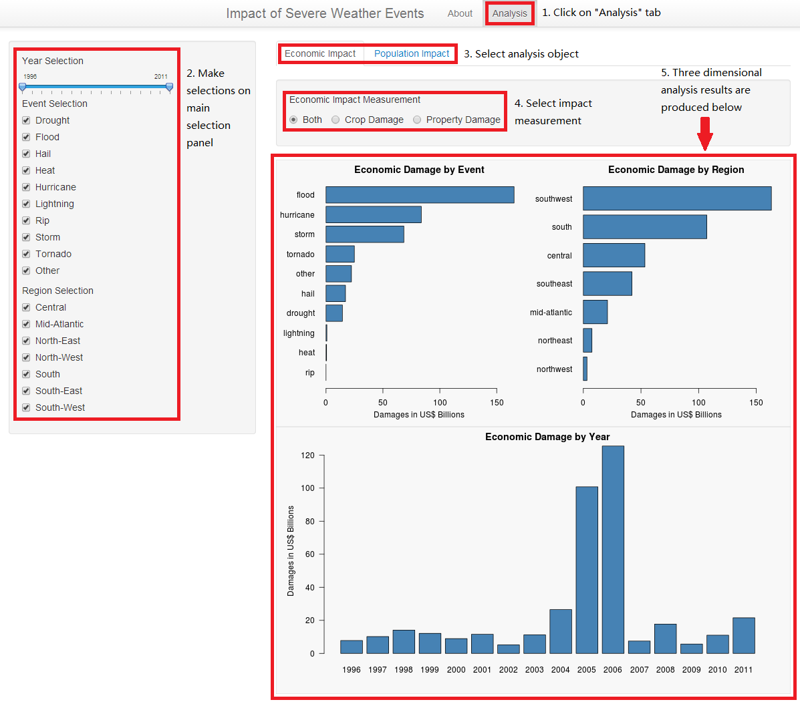

## Impact of Severe Weather Events

#### Developing Data Products Project

### Yichen Liu

---

## Initiation

* #### Severe weather events can cause both public health and economic problems for communities and municipalities

* #### Understanding the impact of these events provides us insights for the future prevention

* #### This application helps us analyse the impact of severe weather events on the economy and the population in the United States

---

## The Data

* #### Utilises data from the U.S. National Oceanic and Atmospheric Administration's (NOAA) storm database

* #### Raw data can be downloaded from: https://d396qusza40orc.cloudfront.net/repdata%2Fdata%2FStormData.csv.bz2

* #### The data is processed using the same data processing method for my Reproducible Research project 

* #### Attributes of the processed data are shown as followed:

```{r, cache = TRUE}
processed_data <- read.csv("Data/data.csv", stringsAsFactors = FALSE)
str(processed_data)
```

--- &twocol

## How to Use

*** =left



*** =right

* #### Access the application from: http://yichenliu.shinyapps.io/Develop_Data_Products/

* #### Click on the "Analysis" tab at the top of the page

* #### Make selections on Year, Events Type and Region on the main selection panel

* #### Select analysis object - "Economic Impact" or "Population Impact"

* #### Select impact measurement

* #### A series of charts will be produced based on your selections

---

## Key Attributes of the Application

* #### Three dimensional analysis - by Region, by Events and by Year

* #### Comprehensive selection panel and your choice of measurement

* #### Clear layout - analyse the impact on the economy or the population
